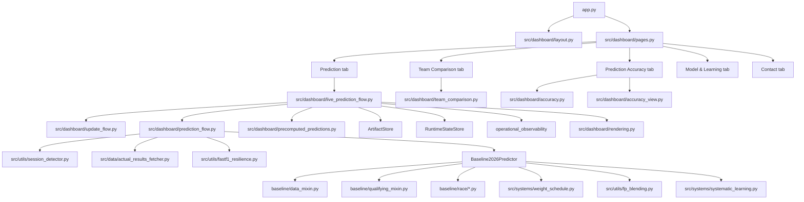

# Architecture

## Design choices

Data is scarce at the start of a season and grows every race. Three choices follow from that:

1. **Blend signals, do not train a model.** Mid-season there is too little data to train one. The predictor blends three explicit signals (baseline, testing, current season) with a weight schedule that depends on the race number. The trust shift stays visible and auditable.
2. **The dashboard only reads.** Background workers generate every forecast ahead of time, so users never wait on a simulation.
3. **One storage interface.** `ArtifactStore` writes local files in development and Supabase in production (Render), with the same code in both.

Model version: `3.0`.

## Runtime map



## Dashboard modules

| File | Job |
|---|---|
| `src/dashboard/cache.py` | FastF1 cache setup, artifact versions, cached predictor |
| `src/dashboard/layout.py` | Page config, theme, header, sidebar |
| `src/dashboard/pages.py` | Tab routing |
| `src/dashboard/live_prediction_flow.py` | Refresh logic and cache keys |
| `src/dashboard/prediction_flow.py` | Weekend forecast chain, actual vs predicted grid |
| `src/dashboard/precomputed_predictions.py` | Keys and storage for precomputed forecasts |
| `src/dashboard/rendering.py` | Qualifying and race tables and charts |
| `src/dashboard/update_flow.py` | Auto-update after races and practice |
| `src/dashboard/team_comparison.py` | Team comparison tab |
| `src/dashboard/accuracy.py` | Accuracy scores from saved forecasts and actuals |
| `src/dashboard/accuracy_view.py` | Accuracy tab charts and KPIs |

## Core components

**Predictor.** `src/predictors/baseline_2026.py`, built from mixins:

- `baseline/data_mixin.py`: artifact loading, blended team strength, compound helpers
- `baseline/qualifying_mixin.py`: qualifying and sprint qualifying
- `baseline/race/params_mixin.py`: race parameters
- `baseline/race/preparation_mixin.py`: driver and team context, compound choice
- `baseline/race/prediction_mixin.py`: lap-by-lap Monte Carlo

**Weight schedule.** `src/systems/weight_schedule.py`. Runs `rapid_adaptive`: 45% current season at race 1, 87% at race 3, 95% from race 4. See `docs/WEIGHT_SCHEDULE_GUIDE.md`.

**Practice blending.** `src/utils/fp_blending.py`. Builds the qualifying forecast from whatever sessions exist. More and cleaner sessions get more weight. Falls back to the testing profile, then to the model alone. See `docs/FP_BLENDING_SYSTEM.md`.

**Race updates.** `src/utils/auto_updater.py`, `src/systems/updater.py`, `scripts/update_from_race.py`. Detects finished races and updates `current_season_performance`. Baseline and testing data stay separate.

**Testing and practice updates.** `src/systems/testing_updater.py`, `scripts/update_from_testing.py`. Extracts car metrics from testing and practice and writes them to car characteristics. The dashboard captures practice sessions automatically.

**Persistence.** `src/persistence/` (`artifact_store.py`, `config.py`, `db.py`, `runtime_state_store.py`) and `src/utils/operational_observability.py`. One load and save interface for all storage modes, runtime locks so practice updates are not applied twice, and event counters in `operational_events`.

**Learning.** `src/systems/systematic_learning.py`, `src/utils/prediction_logger.py`. Updates per-driver and teammate-gap error state from saved forecasts against actuals. Skips retrospective runs, duplicate run IDs and missing or partial actuals. The bounded adjustments feed the next forecast.

**Promotion and diagnostics.** `src/analysis/promotion_gate.py`, `src/analysis/component_diagnostics.py`, `src/models/shadow_challenger.py` and the `scripts/audit_*` and `scripts/generate_evaluation_report.py` scripts. A candidate model must lower MAE without hurting winner or top 3 accuracy or degrading many weekends. The gate writes `production_gate` to `data/evaluation/2026_evaluation_report.json`. See `docs/MODEL_PROMOTION.md`.

## Data

| File | Holds |
|---|---|
| `data/processed/car_characteristics/2026_car_characteristics.json` | Per team: baseline performance, testing metrics, in-season results, uncertainty, compound pace and wear by circuit |
| `data/processed/track_characteristics/2026_track_characteristics.json` | Track profile, overtaking difficulty and rate, pit loss, safety car odds |
| `data/processed/driver_characteristics.json` | Pre-season driver ratings: racecraft, pace, experience, DNF inputs |
| `data/processed/team_race_pace/2026_team_race_pace.json` | Per-race team pace gaps from green-flag laps |
| `data/processed/team_strength_seconds_mapping/latest.json` | Team strength to seconds conversion, fitted on 2026 |

## Qualifying flow

```text
lineups
  -> blended team strength (weight schedule)
  -> session pace blend (practice or sprint sessions)
  -> team + driver skill
  -> Monte Carlo
  -> median grid position and interval
```

## Race flow

```text
grid (actual or predicted)
  -> compound strengths from session history
  -> pit strategies (two-compound rule enforced)
  -> lap-by-lap simulation: tyre wear, fuel, fresh tyre window,
     traffic, pit loss, safety car, lap 1 incidents, retirements
  -> aggregate across simulations
  -> finish order, strategy mix, podium probability
```

## Caches

- FastF1: `data/raw/.fastf1_cache`, testing updater: `data/raw/.fastf1_cache_testing`
- Streamlit cache clears when artifact versions change or a session finishes.

## Not on the live path

- The Bayesian ranking modules are tested but unused by the dashboard.
- `src/systems/learning.py` is legacy. Live learning is `src/systems/systematic_learning.py`.
