# Formula 1 2026 Prediction Engine

Physics-based F1 prediction system optimized for regulation change years.

## Why 2026?

Major regulation changes:
- New power units (50/50 electric/ICE)
- Active aero
- 30kg lighter cars
- New team: Cadillac (11 teams total)

When regulations reset, historical performance matters less. This system adapts quickly using validated weight schedules.

## Quick Start

```bash
# Install dependencies
pip install -r requirements.txt

# Run dashboard
streamlit run app.py
```

**That's it!** The dashboard automatically:
- Detects completed 2026 races when you generate predictions
- Updates team/driver characteristics from real results
- Blends practice data (70% FP + 30% model) for fresh predictions
- Shows progress: "🔄 Found 1 new race(s)! Updating..."
- Tracks prediction accuracy (enable in sidebar)

### How the App Works

```mermaid
graph TD
    A[User Opens Dashboard] --> B[Select Race + Weather]
    B --> C[Click 'Generate Prediction']
    C --> D{Check for<br/>Completed Races}
    D -->|New Races Found| E[🔄 Auto-Update<br/>Extract Results<br/>Update Characteristics]
    D -->|All Up-to-Date| F[Load Predictor]
    E --> F
    F --> G[Check for FP Data]
    G -->|FP Available| H[Blend: 70% FP + 30% Model]
    G -->|No FP Data| I[Use Model Only]
    H --> J[Apply Weight Schedule<br/>Baseline→Testing→Current]
    I --> J
    J --> K[Calculate Track Suitability]
    K --> L[Predict Qualifying]
    L --> M[Predict Race<br/>50 Monte Carlo Sims]
    M --> N[Display Results]
    N --> O{Tracking<br/>Enabled?}
    O -->|Yes| P[💾 Save Prediction<br/>by Session FP1/FP2/FP3/SQ]
    O -->|No| Q[End]
    P --> Q
```



### Manual Update (Optional)

If you want to update characteristics without opening the dashboard:

```bash
python scripts/update_from_race.py "Bahrain Grand Prix" --year 2026
```

## How It Works

**3 Signals, Dynamic Blending**:
1. **Baseline**: 2025 constructor standings (decreases over season)
2. **Testing**: Pre-season testing directionality (decreases over season)
3. **Current**: Running average of 2026 races (increases over season)

**Weight Schedule** (validated on 2021→2022 regulation change):
- Race 1: 30% baseline | 20% testing | 50% current
- Race 2: 15% baseline | 10% testing | 75% current
- Race 3+: 5% baseline | 0% testing | 95% current

**Result**: 0.809 correlation on historical regulation change (vs 0.512 for conservative approach).

## Key Features

- **Physics-based simulation**: Tire deg, lap 1 chaos, DNF probability, weather effects
- **Track-car suitability**: Continuous parameters (straights %, corners %, braking zones)
- **Monte Carlo uncertainty**: 50 simulations per prediction
- **Self-correcting**: Updates after each race, trusts current data quickly
- **Sprint weekend support**: Full cascade predictions (Sprint Quali → Sprint → Main Quali → Main Race)
- **Accuracy tracking**: Save predictions by session (FP1/FP2/FP3/SQ) and compare to actual results

## Architecture

```
Streamlit Dashboard (app.py)
    ↓
Baseline2026Predictor (src/predictors/baseline_2026.py)
    ↓
Weight Schedule System (src/systems/weight_schedule.py)
    ↓
Track-Car Suitability Calculation
    ↓
Monte Carlo Simulation (50 runs)
    ↓
Predictions (Qualifying + Race)
```

## Data Files

- **[data/processed/car_characteristics/2026_car_characteristics.json](data/processed/car_characteristics/2026_car_characteristics.json)**: Team performance (baseline + directionality + current season)
- **[data/processed/track_characteristics/2026_track_characteristics.json](data/processed/track_characteristics/2026_track_characteristics.json)**: Track telemetry profiles
- **[data/processed/driver_characteristics.json](data/processed/driver_characteristics.json)**: Driver skills (racecraft, consistency, wet weather)

## Documentation

- **[ARCHITECTURE.md](ARCHITECTURE.md)**: System design and data flow
- **[CONFIGURATION.md](CONFIGURATION.md)**: Configuration guide
- **[docs/WEIGHT_SCHEDULE_GUIDE.md](docs/WEIGHT_SCHEDULE_GUIDE.md)**: Weight schedule system
- **[docs/FP_BLENDING_SYSTEM.md](docs/FP_BLENDING_SYSTEM.md)**: Practice data blending
- **[docs/WEEKEND_PREDICTIONS.md](docs/WEEKEND_PREDICTIONS.md)**: Sprint and normal weekend cascade predictions
- **[docs/DASHBOARD_AUTO_UPDATE.md](docs/DASHBOARD_AUTO_UPDATE.md)**: Auto-update behavior
- **[docs/PREDICTION_TRACKING.md](docs/PREDICTION_TRACKING.md)**: Prediction accuracy tracking

## Validation

**Notebooks**:
- [validate_testing_predictions.ipynb](notebooks/validate_testing_predictions.ipynb): Regulation change analysis
- [test_weight_schedules.ipynb](notebooks/test_weight_schedules.ipynb): Schedule optimization

**Key Finding**: During regulation changes, pre-season testing is LESS predictive than usual (0.137 vs 0.422 correlation). Solution: Trust it less, adapt to actual results faster.

## Tests

```bash
# Run all tests
pytest tests/

# Run specific test
python tests/test_weight_schedule_integration.py
```

## Project Structure

```
formula1-2026/
├── app.py                          # Streamlit dashboard
├── predict_weekend.py              # CLI prediction tool
├── src/
│   ├── predictors/
│   │   └── baseline_2026.py        # Main prediction engine
│   ├── systems/
│   │   └── weight_schedule.py      # Weight schedule system
│   ├── models/                     # Bayesian models
│   ├── features/                   # Telemetry feature extraction
│   └── utils/                      # Helpers and validators
├── scripts/
│   ├── update_from_race.py         # Post-race data update
│   └── extract_*.py                # Data extraction scripts
├── data/
│   ├── processed/                  # Ready-to-use data
│   └── raw/                        # FastF1 cache
├── tests/                          # Test suite
├── notebooks/                      # Validation studies
└── config/                         # Configuration files
```

## Development Philosophy

1. **Physics-first**: Simulate the actual race, don't just fit curves to data
2. **Transparent**: Explainable predictions, not black-box ML
3. **Self-correcting**: Learn from mistakes, adjust weights automatically
4. **Domain-driven**: Built by someone who understands F1 deeply

## Status

- Core system: ✅ Complete
- Weight schedule: ✅ Integrated and validated
- Dashboard: ✅ Working
- Data update flow: ✅ Implemented
- Weekend cascade: ✅ Sprint and normal weekend support
- Prediction tracking: ✅ Implemented (driver name normalization, session detection, accuracy metrics)
- Testing directionality: ⏳ Awaiting 2026 pre-season testing (Feb 2026)
- Season validation: ⏳ Pending 2026 races

## License

Private project for F1 Fantasy predictions.

## Contact

Tomasz Solis
- [LinkedIn](https://linkedin.com/in/tomaszsolis)
- [GitHub](https://github.com/tomasz-solis)
