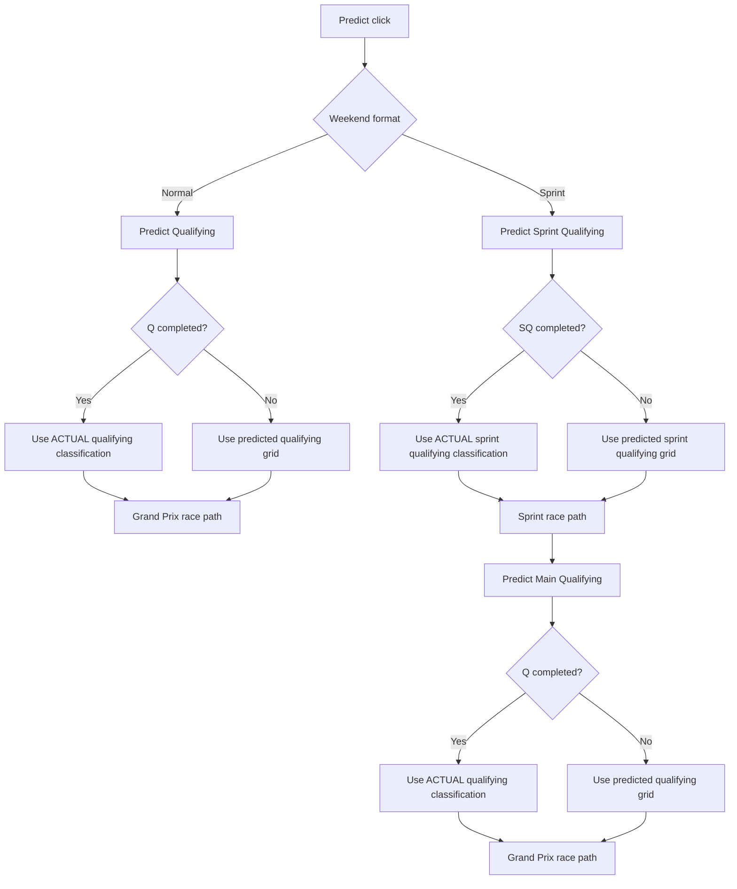

# Weekend forecast flow

The chain of forecasts behind the Predict button (`src/dashboard/pages.py`).

## Normal weekend

1. Qualifying.
2. Race, from the qualifying grid. Once Q has finished, the race uses the actual qualifying result as its grid.

Targets and checkpoints:

- `main_qualifying`: PRE, FP1, FP2, FP3
- `grand_prix_race`: PRE, FP1, FP2, FP3, Q

## Sprint weekend

1. Sprint qualifying.
2. Sprint race, from the sprint qualifying grid (actual once SQ has finished).
3. Main qualifying.
4. Grand Prix, from the main qualifying grid (actual once Q has finished).

Targets and checkpoints:

- `sprint_qualifying`: PRE, FP1
- `sprint_race`: PRE, FP1, SQ
- `main_qualifying`: PRE, FP1, SQ, Sprint
- `grand_prix_race`: PRE, FP1, SQ, Sprint, Q

## Actual or predicted grid

`fetch_grid_if_available()` in `src/dashboard/prediction_flow.py` returns `ACTUAL` when SQ or Q has finished and results are available, otherwise `PREDICTED`. If completion status is unknown, the flow stops for that session instead of guessing.

## Practice data

Qualifying uses practice through `predict_qualifying()` (see `FP_BLENDING_SYSTEM.md`). Without weekend practice it falls back to the testing short-run profile, then to the model alone. `data_source` says which: `Testing short-run profile blend (no weekend practice data)` or `Model-only (no practice/testing data)`.

## Sprint race

`predict_race(..., is_sprint=True)` lowers randomness and weights the grid more. Sprint and Grand Prix races are scored separately; their error profiles differ.

## Saved forecasts

With tracking on, one forecast is saved per finished session, at most once per race and session. A checkpoint can store several targets. An actual result only excludes the target it would contaminate. Saved forecasts may include `shadow_challengers`, which are for audits only and never shown as the forecast. See `PREDICTION_TRACKING.md`.

## Accuracy page

Two views, each split by target and by normal vs sprint weekend:

- Over the weekend: accuracy by checkpoint.
- Over the season: accuracy by round, one line per checkpoint.

Main qualifying and the Grand Prix lead. Sprint targets are secondary.

## Limits

1. Actual grids depend on FastF1 publishing results.
2. Weekend format comes from the FastF1 schedule, with a local fallback.
3. Early sprint weekends may have gaps where a target was never saved at the time.
